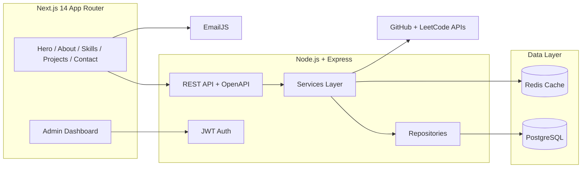

# Shivansh Srivastava Portfolio Platform

A production-grade, full-stack portfolio platform showcasing a modern architecture, secure APIs, and a highly interactive UI.

## Architecture (Overview)



## Monorepo Structure

```
.
├── backend
│   ├── prisma
│   ├── src
│   │   ├── controllers
│   │   ├── middleware
│   │   ├── repositories
│   │   ├── routes
│   │   ├── services
│   │   └── index.ts
│   └── Dockerfile
├── frontend
│   ├── app
│   ├── components
│   ├── lib
│   └── styles
└── docs
```

## Database Schema (Prisma)

See `backend/prisma/schema.prisma` for the complete schema.

## API Contracts

- `GET /api/profile` — Portfolio profile metadata
- `GET /api/skills` — Skills grouped by category
- `GET /api/experience` — Experience timeline
- `GET /api/projects` — Projects list
- `GET /api/github/stats` — GitHub stats
- `GET /api/leetcode/stats` — LeetCode stats
- `POST /api/contact` — Contact form submission
- `POST /api/auth/login` — Admin login
- `GET /api/admin/contacts` — Admin contacts list
- `PATCH /api/admin/projects/:id` — Update project metadata

## EmailJS Setup

1. Create an EmailJS account and configure a service + template.
2. Add the following to `frontend/.env.local`:
   - `NEXT_PUBLIC_EMAILJS_SERVICE_ID`
   - `NEXT_PUBLIC_EMAILJS_TEMPLATE_ID`
   - `NEXT_PUBLIC_EMAILJS_PUBLIC_KEY`
3. Update `frontend/components/contact-form.tsx` with the template variables.

## Deployment

### Frontend (Vercel)
- Set `NEXT_PUBLIC_API_BASE_URL` to the backend URL.
- Add EmailJS env vars.

### Backend (Render/Railway)
- Set `DATABASE_URL`, `JWT_SECRET`, `ADMIN_EMAIL`, `ADMIN_PASSWORD_HASH`, `GITHUB_TOKEN`.
- `npm run build && npm run start`

### Database (Supabase/Neon/RDS)
- Use the `DATABASE_URL` format for PostgreSQL.
- Run `npx prisma migrate deploy`.

## System Design Decisions

- **Layered architecture** for maintainable APIs (controllers, services, repositories).
- **JWT auth** to protect admin operations.
- **Rate limiting** + input validation (Zod) to prevent abuse.
- **Typed fetch** on the frontend to maintain strict contracts.
- **Caching** for GitHub/LeetCode stats (optional Redis).

## Notes

- Experience, skills, and projects are intentionally left data-driven with seed placeholders. Update the database content to match the resume (single source of truth).
- This repo is designed to be production-ready with clear separation of concerns.
